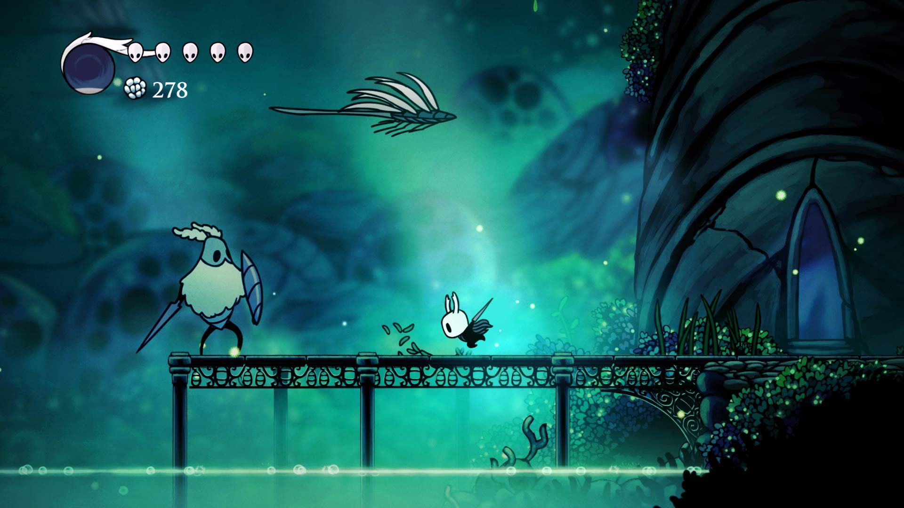

# Indentifying and Defining

## Identifying A Need
### Need
To adress the missrepresentation of Persian culture in video games that also uplifts them.
### The problem
The problem my game will adress is the misrepresentation of Persian culture in video games such as Call of Duty often painting them as terrorists.
### Skill development
To develop the skills in unity required to create the game, I would complete this course [Top Down RPG Unity tutorial](https://www.youtube.com/watch?v=b8YUfee_pzc).
## Requirements Outline
### Inputs
Inputs for the user will be direction keyboard keys, buttons to use and spacebar for jumping.
### Proccessing
The program will check for collisions, calculate the new position of the player and check for keypresses then update gamescore accordingly.
### Outputs
The game will display the characters progress, the characters position, background foreground and the splash screen.
### Transmission
My project will not use any online aspects.
### Storage
The game will save progress and high scores locally to the computer.
## Functional Requirments
### User interaction
The user will interatct with the game through the keyboard for computer and touch controls for andriod or IOS . The user will be able to move the player, pick up and use objects and input data when required. Pressing the arrow keys will result in the player moving and pressing e will use the ability for a selected object.
### Core gameplay
Movement will be fliud and fast. The game will have a grappling hook to be the main mode of transport. The grappling hook will only be able to grapple onto specific objects with a tag. Combat will be with a sword that the player can access by pressing q everything within a certain range of the player will take damage.
### Scoring and feedback
Players will recieve a higher score for two reasons
1. Fast time completing levels
2. Amount of enemies killed
Different enemies are worth different points and depending on the level length the time taken to complete the levels will also contribute to amount of points gained.
### level progression
Different levels in this game are accessed through reaching the end and collecting the finalobject. This final object will unlock the next level for the player. In some specific levels the player must kill all enemies before the next level is unlocked.
### Saving and loading data
All saved data will be saved locally through saved files stored in the games files which are realoaded upon the game being opened again.
## Non-functional requirments
### Performance requirements
The game should be able to respond to user inputs instantly without lag and load fast.
### Usability Requirments
The game has a clear beginner-friendly tutorial to explain the core mechanics to first time users. The UI will also be easy to understand and use.
### Compatibility Requirements
The game will be compatable with computer, IOS and android. Shifting from touchpad to keyboard depending on the device being used.
### Scalability Requirements
The game should be able to scale to include additional levels without impacting performance.
### Security Requirements
No user data will be collected unless the user puts their own name for the player and all data will be stored locally in a secure file.
### Reliability and Availability Requirements
The system should be available all the time as it is an offline game and does not require any internet to access it. Data loss will be prevented by making the game automatically save after reaching a checkpoint or beating a level.
## Consideration of Social and Ethical Issues
### define
- Equity means being fair and impartial.
- Accessibility means the quality of being easy to obtain or use.
### Accessibillity
My project will be able to be used by all people as it does not have any verbal lines but all text will be easily read because it is contrasting with the background and is large enough to read.
### Privacy and Data Protection
My project will collect high scores and the name of a player. All files are stored locally to the players computer and are not used for anything other than the game.
### Fairness and Representation
My project will avoid any steryotypes and infact will try to fix them. My character is Iranian and so am I. This means I am qualified to make a culturally friendly character for the game.
### Mental and Emotional Well-Being
My game will not include anything that can mentally or emotianally affect ones wellbeing. Violence will be minimum if at all.
### Cultural Sensitivites
My game will make to the be mindful of any aspects that could potentially be offensive to different cultures. 

| Existing Idea 	| Plus                                                                                                                                                                                                                                                                                                     	| Minus                                                                                                                                                                                                                        	| Implication                                                                                                                                                                                                                                                                                                                                                                                  	|
|---------------	|----------------------------------------------------------------------------------------------------------------------------------------------------------------------------------------------------------------------------------------------------------------------------------------------------------	|------------------------------------------------------------------------------------------------------------------------------------------------------------------------------------------------------------------------------	|----------------------------------------------------------------------------------------------------------------------------------------------------------------------------------------------------------------------------------------------------------------------------------------------------------------------------------------------------------------------------------------------	|
| Elden ring    	| Elden Rings story is very well thought out and is a reason why many people play it. It is a soul game which is very fun and popular and appeal to a niche set of people.                                                                                                                                 	| On the downside Elden ring is very hard as with all soul games. This means the average person could not beat the game without affects to their mental health or alot of time spent (I know this from personal expieriance).  	| Soul games are very fun but also very hard so I will make a 2d souls like game that imitates Elden Ring story and roleplaying while setting different difficulty levels for different levels of expieriance.                                                                                                                                                                                 	|
| Undertale     	| Undertale is a very iconic pixel art RPG game because of its engaging combat system and its ability to set the mood. It is a turn based fighting system which also allows you to talk to your opponent. Turn based fighting can often seem repetitive but Undertale manages to make it fun and exciting. 	| On the other hand undertale is very tedious because of its one save file that cannot be changed meaning if you mess up backtracking can take up to or more than an hour.                                                     	| Undertales ability to set the mood and have a good expieriance even though the game is made with pixel art it very good along with its ability to make fighting challanging yet not repetitive is somthing I plan to add to my own game. On the other hand it does not allow you to backtrack easily making the game tedious if you make the wrong descision and you find out after an hour. 	|
| Hollow Knight 	| Hollow knight has the most beautiful graphics and music that add so much to the game. Along with that its combat is one of the main reasons I included it on this list.                                                                                                                                  	| Unfortuanatly Hollow Knight is quite bland at first and is very hard for new time gamers that want to play this means some people may turn away from an amazing expiereance because of the difficulty level.                 	| Hollow knights increadible 2d graphics is somthing I plan to impliment in my game along with its amazing fighting mechanics and to make sure anyone can play this game I will make different difficulty levels so expierianced and non-expierianced player can enjoy.                                                                                                                        	|